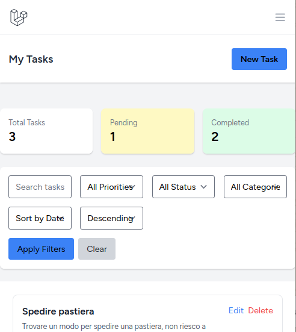
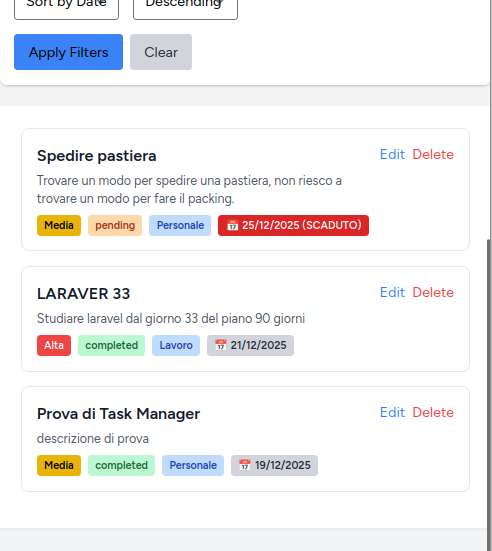
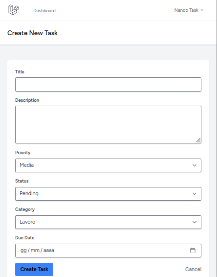
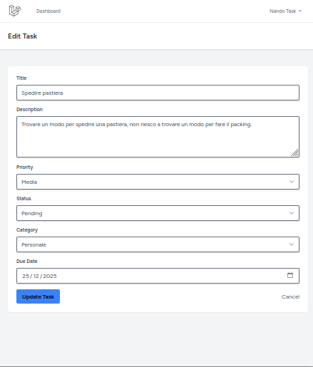

# 📝 Task Manager - Gestionale Attività Aziendale

> Applicazione web completa per la gestione di task aziendali con dashboard statistiche, 
> autenticazione utenti e sistema di categorizzazione.


## 🌐 Demo Online

**URL:** http://159.69.125.94:8080/tasks

Applicazione deployata e funzionante su VPS professionale.

## 📸 Screenshot

### Dashboard Principale

*Dashboard con statistiche task completati, in corso e da fare*

### Lista Task

*Elenco task con filtri avanzati per categoria, stato e data*

### Creazione Task

*Form creazione nuovo task con validazione campi*

### Modifica Task

*Form modifica task esistente con dati pre-compilati*

- Dashboard principale con statistiche
- Pagina elenco task con filtri
- Form creazione/modifica task

## ⚙️ Funzionalità

### Gestione Task
- ✅ Creazione, modifica, eliminazione task (CRUD completo)
- ✅ Assegnazione categorie e priorità
- ✅ Filtri avanzati (stato, categoria, data)
- ✅ Ricerca full-text

### Dashboard
- 📊 Statistiche task per stato (completati, in corso, da fare)
- 📈 Grafici distribuzione per categoria
- 🎯 Task in scadenza evidenziati

### Autenticazione
- 🔐 Login/registrazione utenti
- 🔒 Protezione route con middleware
- 👤 Task personali per ogni utente

## 🛠️ Stack Tecnico

- **Backend:** Laravel 11
- **Database:** MySQL 8.0
- **Frontend:** Blade Templates, Tailwind CSS
- **Server:** Nginx, Ubuntu 24.04
- **Tools:** Git, Composer, npm

## 📋 Database Design
```
users (id, name, email, password)
  └── tasks (id, user_id, title, description, status, category_id, priority, due_date)
        └── categories (id, name, color)
```

## 🚀 Installazione Locale
```bash
# Clone repository
git clone https://github.com/ferdinandociotola/task-manager.git
cd task-manager

# Installa dipendenze
composer install
npm install

# Configura database
cp .env.example .env
php artisan key:generate
php artisan migrate

# Avvia server
php artisan serve
```

## 💡 Perché questo progetto?

Questo progetto dimostra la mia capacità di sviluppare **gestionali aziendali completi** 
con funzionalità reali utilizzate quotidianamente dalle PMI:

- Database design efficiente
- Autenticazione e autorizzazione
- Dashboard con statistiche utili
- UX/UI professionale e intuitiva

## 👨‍💻 Autore

**Ferdinando Ciotola**
- Email: nandociotola@gmail.com
- LinkedIn: [ferdinando-ciotola](https://linkedin.com/in/ferdinando-ciotola)
- Portfolio: [Altri progetti](https://github.com/ferdinandociotola)

## 📄 Licenza

MIT License - Progetto personale per portfolio professionale
